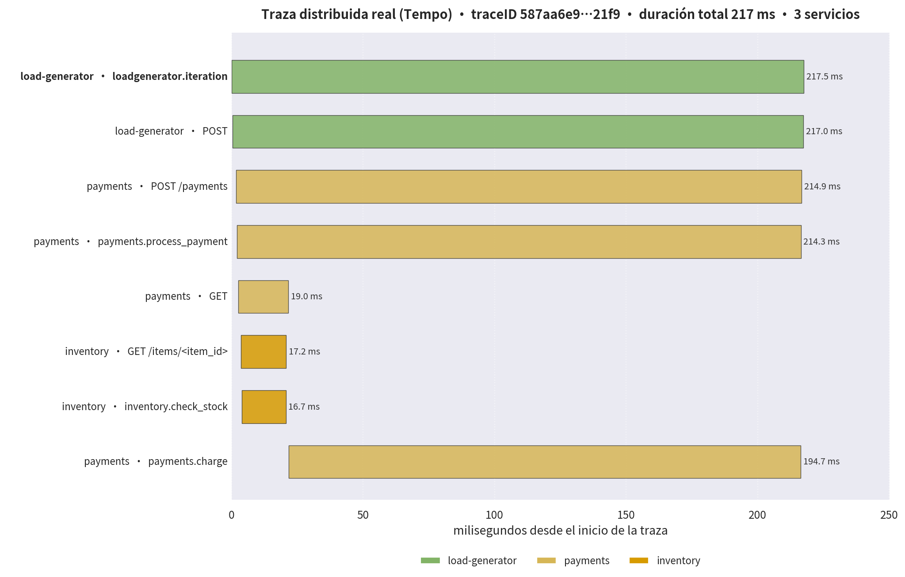

# otel_python_demo

Demo de **trazas distribuidas con OpenTelemetry** usando Python + Flask.
Tres microservicios containerizados con Docker Compose generan trafico
continuo cuyas trazas se envian por OTLP a un backend **Grafana LGTM**
(Grafana + Tempo + Loki + Mimir) que corre en el mismo servidor.

## Arquitectura

```
load-generator  --HTTP-->  payments  --HTTP-->  inventory
     |                        |                    |
     +------------ OTLP gRPC (puerto 4317) --------+
                              |
                    Grafana LGTM (Tempo)
                              |
                    Grafana UI :3029
```


Ver detalle en [docs/ARCHITECTURE.md](docs/ARCHITECTURE.md).
Diagrama editable en [docs/diagrama-arquitectura.drawio](docs/diagrama-arquitectura.drawio).

## Servicios

| Servicio        | Tecnologia | Puerto | Descripcion                                            |
| --------------- | ---------- | ------ | ------------------------------------------------------ |
| `inventory`     | Flask      | 5001   | Catalogo de productos y verificacion de stock          |
| `payments`      | Flask      | 5000   | Recibe pagos y consulta a `inventory` antes de cobrar  |
| `load-generator`| Python     | -      | Genera pagos aleatorios cada ~1s contra `payments`     |

## Requisitos previos

- Docker + Docker Compose en el servidor.
- Backend LGTM corriendo y publicando los puertos OTLP:
  - Grafana UI: `http://192.168.3.60:3029`
  - OTLP gRPC: `192.168.3.60:4317`
  - OTLP HTTP: `192.168.3.60:4318`

> La URL del exporter se configura con la variable
> `OTEL_EXPORTER_OTLP_ENDPOINT` en `docker-compose.yml`.

## Levantar la demo

```bash
cd /tmp/otel_python_demo
docker compose up -d --build
docker compose logs -f load-generator
```

## Probar manualmente

```bash
# Health checks
curl http://192.168.3.60:5000/health
curl http://192.168.3.60:5001/health

# Listar catalogo
curl http://192.168.3.60:5001/items

# Crear un pago (payments -> inventory)
curl -X POST http://192.168.3.60:5000/payments \
  -H "Content-Type: application/json" \
  -d '{"item_id": "SKU-1001", "quantity": 2}'
```

## Ver las trazas en Grafana

1. Abrir `http://192.168.3.60:3029`
2. Ir a **Explore** → datasource **Tempo**
3. Buscar por nombre de servicio, por ejemplo `service.name = "payments"`
4. Abrir una traza: veras la cadena completa
   `load-generator → payments → inventory` con sus spans y atributos.

## Ejemplo de traza real

Traza distribuida capturada de Tempo mientras el generador de carga estaba
activo. Se aprecia la cadena completa: el span raiz `loadgenerator.iteration`,
la llamada HTTP a `payments`, la consulta a `inventory` (~17-19 ms) y el
procesamiento del cargo `payments.charge` (~195 ms de latencia simulada de
la pasarela de pago).



## Dashboard RED (Rate, Errors, Duration)

Existe un dashboard provisionado en Grafana con las métricas que el
**metrics-generator de Tempo** deriva de las trazas
(`traces_spanmetrics_*` en el datasource Prometheus):

- **Tráfico:** request rate por servicio (server spans) e iteraciones/s del generador
- **Errores:** spans con `status_code = ERROR` por servicio
- **Duración:** latencia p50/p95 por servicio y p95 por operación de `payments`
  (se distingue `POST /payments` de `payments.charge` y del `GET` a inventory)

URL: `http://192.168.3.60:3029/d/otel-demo-red`

El JSON del dashboard está versionado en
[dashboards/red-dashboard.json](dashboards/red-dashboard.json); para
reprovisionarlo: `curl -u admin:admin -H 'Content-Type: application/json' -X POST http://192.168.3.60:3029/api/dashboards/db -d '{"dashboard": <json>, "overwrite": true}'`

## Detener

```bash
docker compose down
```
