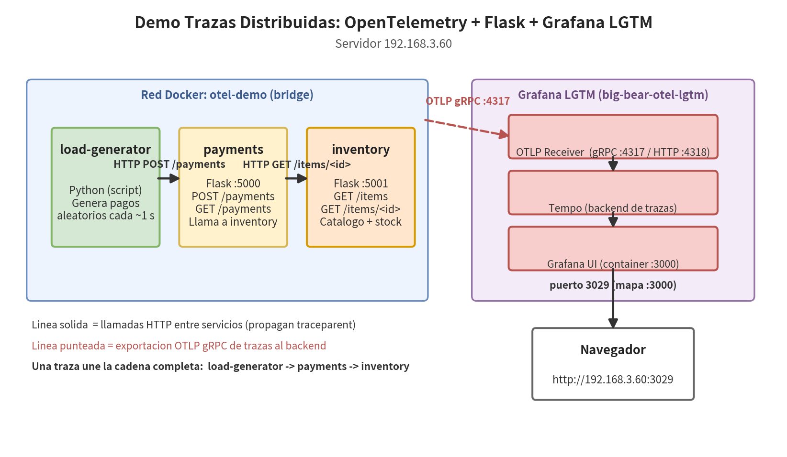

# Arquitectura y Diagrama de Conexiones

## Vision general

Demo de observabilidad con **OpenTelemetry** sobre tres microservicios en
**Python/Flask**, desplegados con Docker Compose en `192.168.3.60`.
Toda la telemetria (trazas) se exporta por **OTLP gRPC** hacia el backend
**Grafana LGTM** (`grafana/otel-lgtm`) que corre como contenedor independiente
(`big-bear-otel-lgtm`) administrado por CasaOS.



## Componentes

| # | Componente        | Tipo              | Ubicacion                     | Puerto(s)        |
| - | ----------------- | ----------------- | ----------------------------- | ---------------- |
| 1 | load-generator    | Python (script)   | contenedor `otel-load-generator` | - (solo salida) |
| 2 | payments          | Flask (REST API)  | contenedor `otel-payments`    | 5000             |
| 3 | inventory         | Flask (REST API)  | contenedor `otel-inventory`   | 5001             |
| 4 | red `otel-demo`   | bridge network    | Docker del servidor           | -                |
| 5 | OTEL Collector    | receptor OTLP     | dentro de `otel-lgtm`         | 4317 (gRPC), 4318 (HTTP) |
| 6 | Tempo             | backend de trazas | dentro de `otel-lgtm`         | 3200 (interno)   |
| 7 | Grafana           | UI / visualizacion| dentro de `otel-lgtm`         | 3000 → host **3029** |

## Flujo de una peticion (traza distribuida)

```
load-generator                              payments                          inventory
     |                                          |                                 |
     | POST /payments {item_id, quantity}       |                                 |
     |─────────────────────────────────────────>|                                 |
     |  span: loadgenerator.iteration           | span: POST /payments            |
     |                                          |────────────────────────────────>|
     |                                          |  span: payments.process_payment | span: GET /items/<id>
     |                                          |                                 |  span: inventory.check_stock
     |                                          |<────────────────────────────────|
     |                                          |  (HTTP 200 + stock)             |
     |                                          | span: payments.charge           |
     |<─────────────────────────────────────────|                                 |
     |  (HTTP 201 payment approved)             |                                 |
```

1. **load-generator** inicia una iteracion (span raiz `loadgenerator.iteration`)
   y envia `POST /payments` con un producto y cantidad aleatorios.
2. **payments** crea el span `payments.process_payment` y llama a
   `inventory` mediante `requests` (instrumentado automaticamente). El
   **contexto de traza se propaga** via header `traceparent`, por lo que el
   span de inventory queda como hijo del mismo *trace*.
3. **inventory** ejecuta `inventory.check_stock` contra su catalogo en
   memoria y responde.
4. **payments** registra el cargo (`payments.charge`, con latencia simulada)
   y responde `201` (o `400`/`409` si el producto no existe o no hay stock).
5. Los tres servicios **exportan sus spans por OTLP gRPC** a
   `192.168.3.60:4317`.

## Instrumentacion OpenTelemetry

Cada servicio configura:

| Pieza | Libreria |
| ----- | -------- |
| SDK / TracerProvider | `opentelemetry-sdk` |
| Exportador | `opentelemetry-exporter-otlp-proto-grpc` (OTLP gRPC) |
| Auto-instrumentacion HTTP servidor | `opentelemetry-instrumentation-flask` |
| Auto-instrumentacion HTTP cliente | `opentelemetry-instrumentation-requests` |

Configuracion por variables de entorno (ver `docker-compose.yml`):

| Variable | Valor | Descripcion |
| -------- | ----- | ----------- |
| `OTEL_SERVICE_NAME` | `inventory` / `payments` / `load-generator` | Nombre del servicio en las trazas |
| `OTEL_EXPORTER_OTLP_ENDPOINT` | `192.168.3.60:4317` | Receptor OTLP del LGTM |
| `INVENTORY_URL` | `http://inventory:5001` | URL interna (red Docker) usada por payments |
| `PAYMENTS_URL` | `http://payments:5000` | URL interna usada por el generador |
| `LOAD_INTERVAL_SECONDS` | `1.0` | Intervalo entre peticiones del generador |

## Como ver las trazas (Grafana)

1. Abrir `http://192.168.3.60:3029`
2. **Explore** → seleccionar el datasource **Tempo**
3. Query por servicio: `service.name = "payments"` (o `inventory`,
   `load-generator`)
4. Abrir cualquier traza para ver el arbol completo de spans:
   - duracion de cada span
   - atributos: `payment.item_id`, `payment.quantity`, `inventory.stock`,
     `load.http_status`, etc.
   - eventos: `insufficient_stock`, `inventory_lookup_failed`

## Archivos del repositorio

```
otel_python_demo/
├── docker-compose.yml          # Orquestacion de los 3 servicios
├── README.md                   # Inicio rapido
├── docs/
│   ├── ARCHITECTURE.md         # Este documento
│   ├── diagrama-arquitectura.drawio   # Diagrama editable (diagrams.net)
│   └── images/architecture.png # Render del diagrama
├── inventory/                  # Servicio Flask: catalogo + stock
│   ├── Dockerfile
│   ├── app.py
│   └── requirements.txt
├── payments/                   # Servicio Flask: cobros (llama a inventory)
│   ├── Dockerfile
│   ├── app.py
│   └── requirements.txt
└── load-generator/             # Script de carga continua
    ├── Dockerfile
    ├── generator.py
    └── requirements.txt
```
